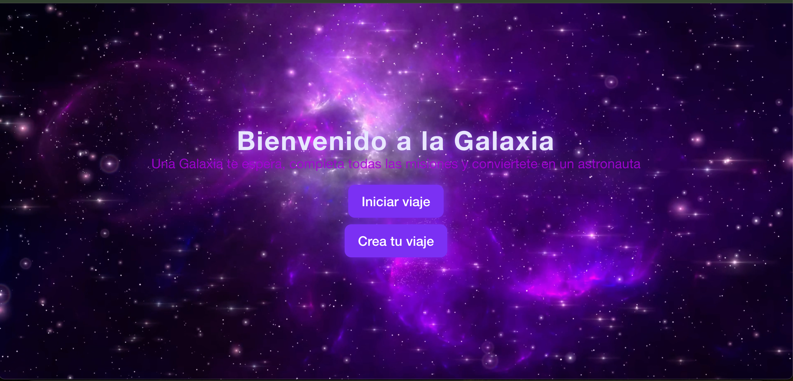
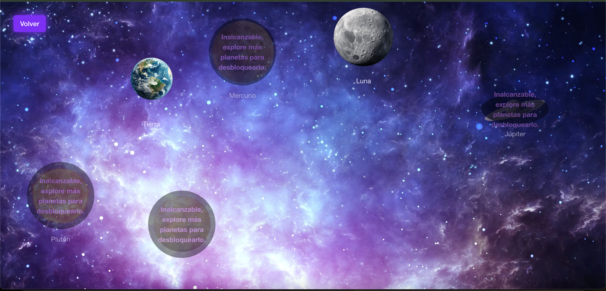
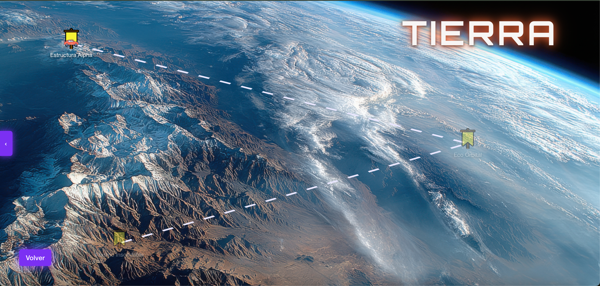
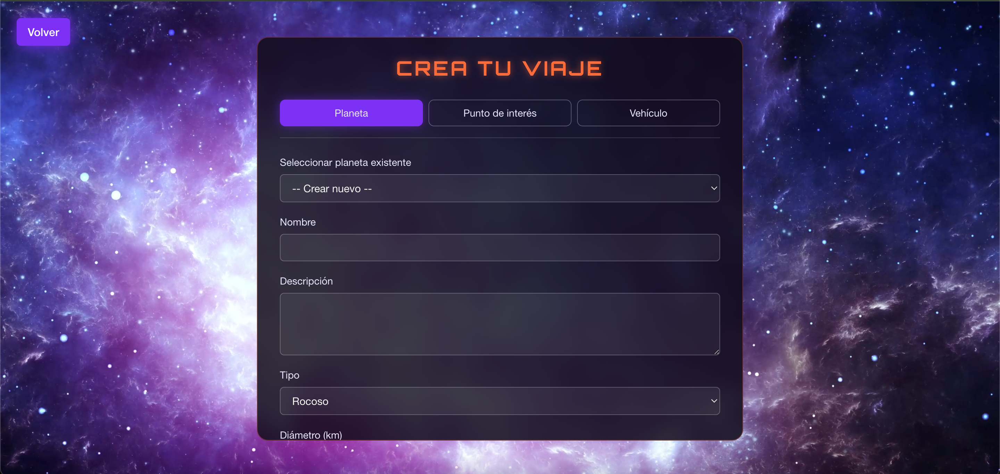

# Ingenieros de la Galaxia - TP integrador para la materia introducción al desarrollo de software.


Los integrantes del grupo son:
- Lucas Mazzuchi
- Mariano Verruno
- Fernando Hugo Godoy Delgado
- Juan Daniel Condori Miranda

## Frontend
El frontend utiliza HTML para estructurar el contenido de la página y CSS agrega el estilo espacial que predomina en la plataforma utilizando el framework Bulma. Por último, JavaScript se utiliza para manejar la lógica del lado del cliente y la integración con el backend, mostrando así, todos los cambios realizados por pantalla.

## Backend
En el backend, hacemos uso de CORS para gestionar las solicitudes entre el frontend y el backend. Utilizamos PostgreSQL como base de datos donde se almacena el estado de la plataforma. Los métodos HTTP utilizados son: GET, POST, PATCH, DELETE.

## Requisitos
Para ejecutar el proyecto, tenés que tener instalado:
- Git: https://git-scm.com/
- Docker: https://docs.docker.com/engine/install/
- Recordá declarar las siguientes variables de entorno en un .env a tu gusto en la raíz del proyecto:
    - DB_USER
    - DB_PASSWORD
    - DB_NAME
    - DB_PORT
    - BACKEND_PORT
    - FRONTEND_PORT
- Además, cambiá la constante puerto en el archivo frontend/constantes.js por el puerto que pusiste en BACKEND_PORT.


## Como levantar el proyecto
```bash
git clone git@github.com:LucasMazzuchi/Ingenieros_de_la_Galaxia.git
cd Ingenieros_de_la_Galaxia
docker compose up
```

Una vez que la terminal indique que los contenedores están corriendo, abrí tu navegador
en http://localhost:<FRONTEND_PORT> para acceder a la página inicial.

## Apagado
```bash
docker compose down
```
## Pantalla Inicial


## Mapa de los planetas


## Mapa de un planeta


## Interfaz de Creado


